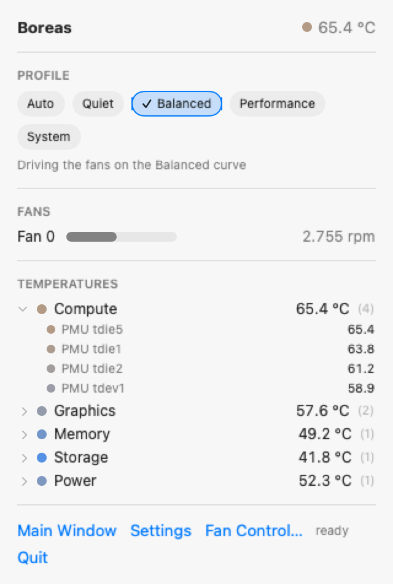
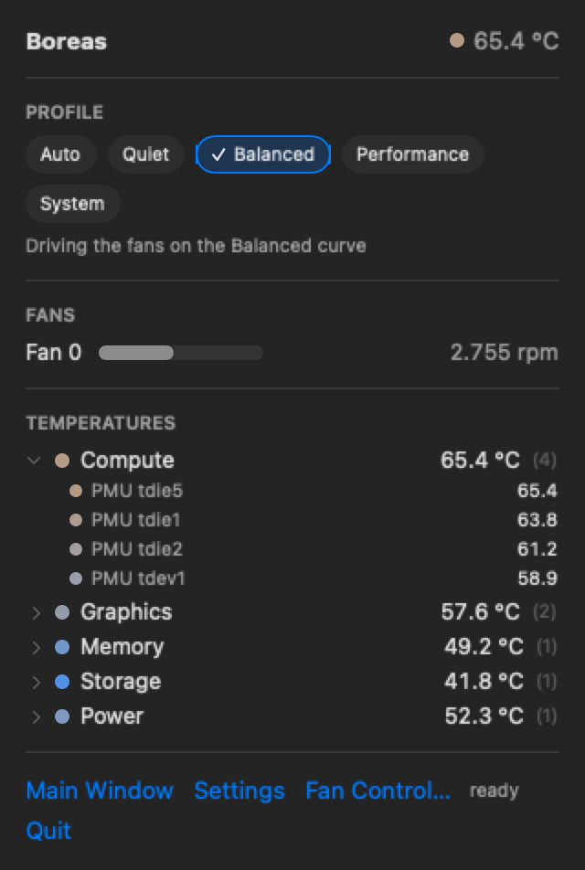
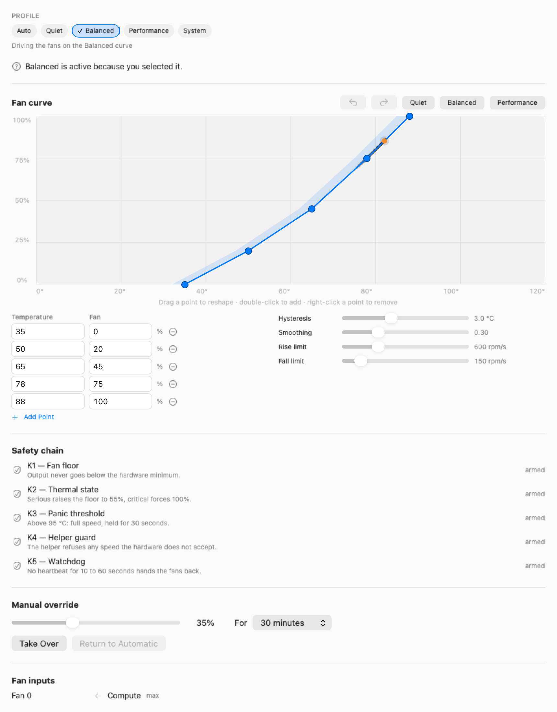

<div align="center">


# Boreas

**Control de ventiladores y monitorización de temperaturas para Mac con Apple Silicon**

Gratuito y de código abierto. Sin extensión del kernel, sin cambios en SIP, sin telemetría.

[](https://github.com/mahirozdin/boreas-mac-fan-control/actions/workflows/ci.yml)
[](LICENSE)
[](#requisitos)
[](#requisitos)
[](https://swift.org)

[Türkçe](README.tr.md) · [English](README.md) · [Русский](README.ru.md) · **Español** · [简体中文](README.zh-Hans.md)

</div>

---

> **Esta es una traducción y puede quedarse atrás respecto a la versión en
> inglés.** El texto vinculante es siempre [`README.md`](README.md); si algo no
> coincide, el inglés es el correcto.

> **Beta — 0.1.1.** Firmado, notarizado y listo para instalar. Se ha ejecutado en
> **un solo Mac**, un Mac mini (M4, 2024); cualquier otro modelo con Apple Silicon
> debería funcionar y ninguno se ha probado. Trátalo como software en pruebas:
> vigila las temperaturas durante los primeros usos y sal de Boreas si algo no
> pinta bien — salir devuelve los ventiladores al firmware de inmediato. La
> monitorización por sí sola no requiere ningún privilegio y no cambia nada, que
> es la forma segura de empezar.

## Qué hace

<div align="center">


</div>

Boreas es una app de la barra de menús que muestra lo que ocurre dentro de tu Mac
y te deja decidir cómo debe refrigerarse.

- **Lee todos los sensores de temperatura** que expone tu Mac: núcleos de
  rendimiento y de eficiencia, GPU, memoria, almacenamiento, alimentación, chasis
- **Ve las velocidades de los ventiladores** con su mínimo y su máximo reales
- **Define tú mismo la curva** con una curva continua en lugar de una lista de
  reglas de encendido y apagado, para que los cambios de velocidad sean suaves y
  no escalonados
- **Cambia de perfil automáticamente** según la fuente de alimentación, la app en
  ejecución, la hora del día o la presión térmica
- **Registra mediciones** en JSONL o CSV, con un techo de disco que nunca supera
- **Entérate cuando algo cambia** — umbrales, presión térmica, un ventilador que
  deja de seguir su objetivo — con controles de ruido que un pánico aún atraviesa
- **Conéctalo a tus propias herramientas** con un webhook o un script, en lugar
  de un cliente de correo que nadie quiere mantener
- **Léelo en cinco idiomas**: inglés, turco, ruso, español y chino simplificado
- **Silencio o frescor**: la decisión es tuya, no del firmware

## Por qué

En Apple Silicon la refrigeración la controla íntegramente el firmware y no
ofrece ningún ajuste. Eso es un problema en las dos direcciones.

**A veces es demasiado silencioso.** Durante una compilación larga, una
exportación de vídeo o una máquina virtual, el firmware sube tarde y con
prudencia. El chip se estrangula y el trabajo que podría haber terminado antes no
termina.

**A veces es demasiado ruidoso.** Grabando audio, trabajando de noche, en una
reunión: momentos en los que unos grados más serían un intercambio estupendo por
el silencio.

Ambos vienen del mismo sitio: la decisión está cerrada para ti. Boreas la abre.

## Requisitos

| | |
|---|---|
| **Mac** | Apple Silicon — M1 o posterior. Intel queda fuera por diseño |
| **macOS** | 14.0 Sonoma o posterior |
| **Disco** | Unos pocos megabytes |

### Hardware probado

Boreas se desarrolla en una sola máquina, así que ser honesto sobre la cobertura
importa más que una tabla de compatibilidad larga.

| Hardware | Estado |
|---|---|
| Mac mini (M4, 2024) — `Mac16,10` | **Verificado en hardware real**: 40 sensores con nombre y 1 ventilador medido de 1000 hasta 4021 rpm con una curva editada, devuelto al firmware en cada ruta de fallo |
| Cualquier otro Mac con Apple Silicon | **Debería funcionar; sin verificar.** Nadie lo ha ejecutado en uno |


**Una nota sobre los portátiles.** Todas las mediciones de aquí vienen de un Mac
de sobremesa. Un MacBook tiene menos margen térmico y se estrangula antes, así
que una curva cómoda en un Mac mini puede quedarse corta en un portátil, y con
batería el firmware es aún más prudente. Nada del diseño es específico de
sobremesa: simplemente no se ha probado ahí, y un informe de sensores desde un
MacBook sería igual de útil.

**Qué significa «sin verificar» en la práctica.** Los nombres de los sensores
cambian entre generaciones de chips, y los modelos con varios ventiladores
ejercitan un código de equilibrado que nunca ha visto un segundo ventilador. Nada
de esto es teórico: la correspondencia es una heurística sobre claves de
hardware, y la tuya puede producir sensores que Boreas no reconozca.

Si tu Mac muestra sensores como `uncategorized`, esa información es útil:
**Ajustes → Sensores → Informar de estos sensores** abre en tu navegador un
[informe de sensor desconocido](https://github.com/mahirozdin/boreas-mac-fan-control/issues/new?template=unknown_sensor.yml)
ya rellenado, que lleva el identificador de modelo de tu Mac, su chip, los nombres
de los sensores no reconocidos y el número de ventiladores, y nada más. Los
sensores sin correspondencia se muestran en lugar de ocultarse precisamente para
que puedan comunicarse.

## Instalación

**Beta.** Firmado y notarizado, así que se instala sin rodeos con Gatekeeper.

```bash
brew tap mahirozdin/boreas
brew trust mahirozdin/boreas   # Homebrew pregunta antes de usar un tap de terceros
brew install --cask boreas
```

O descarga el `.dmg` firmado desde
[la última versión](https://github.com/mahirozdin/boreas-mac-fan-control/releases/latest)
y compruébalo con el `.sha256` publicado a su lado:

```bash
shasum -a 256 -c Boreas-0.1.1.dmg.sha256
```

Compilar desde el código también funciona, y es la única vía si quieres cambiar
algo:

```bash
git clone https://github.com/mahirozdin/boreas-mac-fan-control.git
cd boreas-mac-fan-control
brew bundle          # xcodegen, swiftlint, xcbeautify
make generate        # genera el proyecto de Xcode a partir de project.yml
```

Después abre `Boreas.xcodeproj` y ejecútalo. **La monitorización funciona sin
firma.** El control de ventiladores necesita el asistente con privilegios, y
macOS solo registrará uno firmado con un Developer ID, así que necesitarás tu
propia identidad de firma en `Local.xcconfig` (copia `Local.xcconfig.example` y
pon tu identificador de equipo). Sin ella, Boreas es un monitor completo que no
pide nada.

## Primeros pasos

1. **Abre Boreas.** Aparece en la barra de menús y empieza a leer sensores de
   inmediato: sin permisos, sin configuración, sin nada que ajustar.
2. **Elige un perfil** en el panel: Silencioso, Equilibrado, Rendimiento o
   Sistema para devolverlo todo al firmware.
3. **Activa el control de ventiladores** cuando quieras que la curva los controle
   de verdad. Es el único paso que pide tu contraseña de administrador, una vez.

Los pasos 1 y 2 son útiles por sí solos. El paso 3 es opcional y reversible.

## Permisos

Esta es la parte que conviene leer antes de instalar cualquier cosa que toque tus
ventiladores.

**Qué pide Boreas**

| Permiso | Cuándo | Con qué frecuencia |
|---|---|---|
| Contraseña de administrador | Solo al activar el control de ventiladores | **Una vez** |
| Permiso en segundo plano | Al registrar el asistente | Una vez, en Ajustes del Sistema |
| Notificaciones | Solo si activas los avisos | Una vez |

**Qué no pide nunca Boreas**

- ❌ Desactivar System Integrity Protection
- ❌ Una extensión del kernel o un driver de DriverKit
- ❌ Arrancar en Recovery o cambiar la política de seguridad
- ❌ Acceso total al disco
- ❌ Accesibilidad o grabación de pantalla
- ❌ Cámara, micrófono, ubicación, contactos o calendario

**Leer temperaturas no requiere ningún privilegio.** Si nunca activas el control
de ventiladores, Boreas es una herramienta de monitorización completa que no pide
nada.

Eliminar la app deja todo como estaba. No se toca el firmware ni la NVRAM, y los
ajustes de los ventiladores vuelven a los valores por omisión de macOS en cuanto
Boreas se detiene.

## Cómo funciona

```
Tu sesión (sin privilegios)          Root                     Hardware
┌──────────────────────┐   XPC     ┌────────────────┐  IOKit ┌──────────────┐
│ Boreas.app           │◀────────▶ │ Asistente      │◀─────▶ │ SMC          │
│  motor de control    │   ambos   │  filtro de seg.│        │ sensores HID │
│  lectura de sensores ┼───────────┼────────────────┼──────▶ │ alimentación │
│  configuración       │  verifican│  watchdog      │        └──────────────┘
└──────────────────────┘   firmas  └────────────────┘
```

Leer temperaturas no necesita privilegios, así que va directo al hardware. Solo
escribir velocidades requiere el asistente, y toda su superficie son cuatro
métodos: describir los ventiladores, aplicar objetivos, devolverlos y un latido.

No lee ninguna configuración, no abre ninguna conexión de red y no inicia ningún
proceso.

## El editor de curvas

<div align="center">

</div>

La curva es continua, no una escalera de umbrales. Arrastra un punto, haz doble
clic para añadir uno, clic derecho para quitarlo. La forma no puede volverse
inválida: las ediciones se recortan en lugar de rechazarse, así que ninguna
secuencia de arrastres produce una curva que baje al calentarse. Cada edición
llega a los ventiladores en un ciclo.

## Seguridad

Un software de control de ventiladores que se equivoca aquí daña el hardware, así
que el diseño pone la seguridad por delante de las preferencias en cinco lugares.

| Capa | Regla | ¿Se puede desactivar? |
|---|---|---|
| Suelo del ventilador | Nunca por debajo del mínimo del hardware | No |
| Estado térmico | macOS informa `serious` → subir; `critical` → velocidad máxima | No |
| Umbral de pánico | Cualquier sensor pasado del límite → velocidad máxima, mantenida | No, solo bajarlo |
| Guarda del asistente | Los comandos fuera de rango se rechazan, no se recortan | No |
| **Watchdog** | Sin latido → los ventiladores vuelven al firmware | No |

El watchdog es el que más importa. Si Boreas se cae, se cuelga, lo fuerzas a
salir o cierras la sesión, el asistente nota el silencio y devuelve el control al
firmware por su cuenta. No depende de que la app recoja tras de sí, porque los
casos que importan son exactamente aquellos en los que no puede.

Cada capa solo puede subir la velocidad. Ninguna puede bajarla.

**Lo que Boreas no puede hacer:** no puede enfriar un Mac cuyo firmware ya ha
detenido los ventiladores, y no puede superar la velocidad máxima que informa el
hardware. Donde el firmware rechaza un comando, el asistente también lo rechaza
en lugar de reintentarlo.

## Privacidad

- **Sin telemetría.** Ningún SDK de analítica, ningún SDK de informes de fallos,
  ningún identificador publicitario
- **Sin red por omisión.** Recién instalado, Boreas no hace ninguna conexión. El
  único código capaz de abrir una vive en un solo directorio y solo se ejecuta si
  tú configuras un webhook
- **Tus datos siguen siendo tuyos**, en archivos que puedes leer, en tu máquina

No son promesas de intenciones. Se comprueban en cada commit con una
[verificación que rompe la compilación](scripts/gates/check-privacy.sh) si
aparece un símbolo de analítica o una llamada de red inesperada.

## Configuración

Todo vive en un archivo que puedes leer, editar y poner bajo control de versiones:

```
~/Library/Application Support/Boreas/config.json
```

```json
{
  "schemaVersion": 1,
  "general": { "samplingIntervalSeconds": 2 },
  "safety": { "panicTemperatureCelsius": 95, "watchdogTimeoutSeconds": 15 },
  "profiles": [
    {
      "name": "Quiet",
      "priority": 0,
      "binding": {
        "input": { "group": "compute", "aggregate": "max" },
        "curve": [
          { "celsius": 40, "duty": 0    },
          { "celsius": 58, "duty": 0.15 },
          { "celsius": 72, "duty": 0.4  },
          { "celsius": 82, "duty": 0.7  },
          { "celsius": 88, "duty": 1    }
        ]
      },
      "hysteresis": 5,
      "smoothing": 0.2,
      "slew": { "maxRisePerSecond": 300, "maxFallPerSecond": 100 }
    }
  ]
}
```

Ese fragmento está copiado de un `boreas export` real, no escrito a mano: un
ejemplo que no carga es peor que ningún ejemplo.

Un archivo corrupto solo puede replegarse: Boreas sigue funcionando con el último
estado válido y deja los ventiladores al firmware en lugar de actuar sobre un
documento que no entiende. `config.backup.json` se refresca **antes** de cada
escritura. Los valores fuera de rango se recortan, no se rechazan.

Esquema completo: [`schema/config.schema.json`](schema/config.schema.json) ·
Referencia: [`docs/architecture/configuration.md`](docs/architecture/configuration.md)

## Línea de comandos

`boreas` hace todo lo que hace la barra de menús, en una máquina sin servidor de
ventanas:

```
boreas status            temperaturas, ventiladores y alimentación de un vistazo
boreas sensors [--raw]   todos los sensores, agrupados; --raw muestra los nombres del hardware
boreas profile [nombre]  lista los perfiles, o activa uno ahora
boreas profile --auto    devuelve la decisión a los disparadores de perfil
boreas install           instala el asistente de control de ventiladores
boreas uninstall [--all] elimina el asistente; --all borra también los ajustes
boreas export [archivo]  escribe la configuración; a stdout si no se indica archivo
boreas import <archivo>  reemplaza la configuración, tras validarla
```

```console
$ boreas status
power    : adapter
sensors  : 40  hottest PMU Die 1 75.1 C
fan 0    : Fan 1 1000 rpm (1000-4900, 0%)
control  : activado
```

Un perfil elegido desde la línea de comandos **solo está activo en el momento y
nunca se escribe en disco**: una elección guardada anularía para siempre todos los
disparadores de perfil.

## Resolución de problemas

Parte de lo que parece un fallo es una garantía de seguridad haciendo su trabajo,
así que conviene tener a mano la versión corta:

| Lo que ves | Motivo más probable |
|---|---|
| Las velocidades nunca cambian | El control de ventiladores no está activado: leer no necesita privilegios, escribir necesita el asistente. Sin él, Boreas es un monitor y **no muestra ningún error**, por diseño |
| El asistente se queda «esperando aprobación» | El segundo paso es de macOS: Ajustes del Sistema → General → Ítems de inicio y extensiones |
| El perfil nunca cambia solo | Una elección manual está por encima de cualquier disparador y no caduca salvo que le pusieras un límite de tiempo. `boreas profile --auto` devuelve la decisión |
| Las velocidades vuelven solas | El watchdog. Al salir, fallar, dormir o cerrar sesión, los ventiladores vuelven al firmware sin condiciones: eso es la función, no un error |
| Ventiladores clavados al máximo | El umbral de pánico o el estado térmico de macOS. Ambos se sueltan solos; ninguno se puede desactivar |
| Sensores sin clasificar | Las claves de los sensores son códigos opacos y los no reconocidos se muestran en vez de ocultarse, para poder comunicarlos |
| No llegan notificaciones | No se pide nada hasta que activas los avisos, y un rechazo vuelve a apagar el interruptor |
| Un ajuste no se guardó | Un perfil elegido desde la CLI está activo solo en el momento, a propósito. Un archivo de configuración corrupto se repliega al último estado válido |

Todo el detalle, incluido qué recopilar antes de abrir una incidencia:
[`docs/operations/troubleshooting.md`](docs/operations/troubleshooting.md).

## Desinstalación

```bash
boreas uninstall --all
```

Eso elimina el asistente con privilegios y borra
`~/Library/Application Support/Boreas`. Después arrastra la app a la Papelera.

Sin `--all` se elimina el asistente y se conservan tus ajustes. En cualquier caso:

- **Los ventiladores vuelven al firmware de inmediato**: el asistente los entrega
  al detenerse, y el watchdog lo haría igualmente
- No se toca ningún ajuste de firmware, variable de NVRAM ni archivo del sistema,
  porque nunca se escribió ninguno
- No queda nada en `LaunchDaemons`, y `launchctl` ya no conoce el servicio

Esto no se dio por supuesto: se verificó desde cinco ángulos — el estado de
`SMAppService`, `launchctl`, las carpetas del sistema, el directorio de soporte
borrado y el proceso ausente. **No se vuelve a comprobar automáticamente:**
`install` y `uninstall` cambian el registro del asistente y piden una contraseña,
así que la batería de pruebas de línea de comandos ejercita deliberadamente todo
menos esos dos.

## Hoja de ruta

| Fase | Estado |
|---|---|
| Sistema de documentación y verificaciones | ✅ Hecho |
| Herramientas y esqueleto del proyecto | ✅ Hecho |
| Lectura de sensores y ventiladores | ✅ Hecho |
| Asistente con privilegios y XPC | ✅ Hecho |
| Control de ventiladores y cadena de seguridad | ✅ Hecho |
| Motor de control — curvas, histéresis, perfiles | ✅ Hecho |
| Interfaz y editor de curvas | ✅ Hecho (queda una pasada con VoiceOver) |
| Notificaciones, registro, diagnóstico, CLI, automatización | ✅ Hecho |
| Firma, notarización, publicación | ✅ Hecho — 0.1.1 firmado, notarizado y publicado como beta |

Más adelante, y deliberadamente no antes de la 1.0: un widget de WidgetKit, App
Intents, un punto de métricas local, compartir configuraciones y actualizaciones
dentro de la app.

Estado actual y siguiente tarea: [`TODO.md`](TODO.md).

## Preguntas que la gente hace de verdad

**¿Por qué se calienta mi Mac?**
Normalmente por carga sostenida: compilar, exportar vídeo, máquinas virtuales.
En un MacBook, una habitación cálida o una rejilla obstruida convierten la misma
carga en estrangulamiento antes. Boreas muestra qué parte del chip está caliente,
para que distingas una CPU ocupada de un problema de refrigeración.

**¿Se puede controlar la velocidad de los ventiladores en un Mac con Apple Silicon?**
Sí, a través del System Management Controller, con un pequeño asistente con
privilegios. Boreas pide la contraseña de administrador una vez y nunca más la
necesita.

**¿Hace falta desactivar SIP o instalar una extensión del kernel?**
No. Ninguna de las dos. Esa es la razón principal de que el proyecto tenga la
forma que tiene.

**¿Es seguro bajar la velocidad de los ventiladores?**
Bajarla aumenta el riesgo térmico, y por eso las cinco capas de seguridad solo
pueden subir la velocidad, y tres de ellas no se pueden desactivar.

**¿Qué pasa si la app se cae?**
El asistente deja de recibir latidos y devuelve los ventiladores al firmware en
segundos. Está probado, no supuesto.

**¿Funcionará en mi Mac con Intel?**
No. Los Mac con Intel usan otra disposición de sensores y de SMC, y admitir ambas
duplicaría una base de código mantenida por una sola persona.

**¿Puede enviarme un correo cuando el Mac se calienta?**
Directamente no, y es deliberado. Un webhook o un script de una línea sí pueden, y
ninguno de los dos hace que este proyecto sea responsable de guardar tu contraseña
de correo: hay un ejemplo listo en
[`docs/operations/notifications.md`](docs/operations/notifications.md).

## Contribuir

Los informes de errores, los informes de hardware y las correcciones de traducción
son bienvenidos. Lee antes [`CONTRIBUTING.md`](CONTRIBUTING.md): cubre la
configuración, el flujo de trabajo y las reglas que este proyecto se aplica a sí
mismo.

Lo más útil que puedes aportar ahora mismo es un **informe de sensores desde un
Mac que no sea un mini M4**. Tres de los cinco idiomas de la interfaz tampoco los
ha leído un hablante nativo; [`TRANSLATORS.md`](TRANSLATORS.md) dice exactamente
cuáles.

### Desarrollo

```bash
make next            # indica cuál es la siguiente tarea
make check           # ejecuta todas las verificaciones — deben estar en verde antes de un push
make test            # pruebas de los paquetes Swift
make smoke           # prueba de humo de hardware en un Mac real
```

Este repositorio usa un flujo de trabajo dirigido por documentos con reglas que
comprueba la máquina. Empieza por [`BOOT.md`](BOOT.md), luego
[`AGENTS.md`](AGENTS.md) y luego [`TODO.md`](TODO.md). Configuración y comandos de
diagnóstico propios de la app:
[`docs/development/setup.md`](docs/development/setup.md).

## Aviso legal

Boreas se ofrece tal cual, sin garantía de ningún tipo. **Bajar la velocidad de
los ventiladores aumenta el riesgo térmico, y esa responsabilidad es tuya.**
Cualquier efecto sobre la garantía de tu hardware también lo es. Este proyecto no
está afiliado a Apple Inc., ni autorizado ni respaldado por ella.

## Licencia

[Apache-2.0](LICENSE). Atribuciones y avisos de marcas: [`NOTICE`](NOTICE).

<div align="center">
<sub>Boreas — el viento del norte.</sub>
</div>
