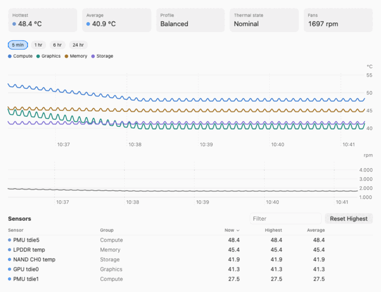
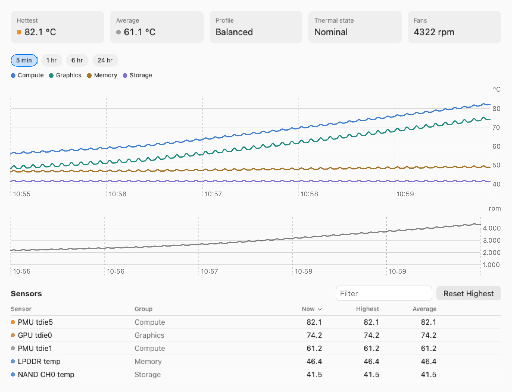
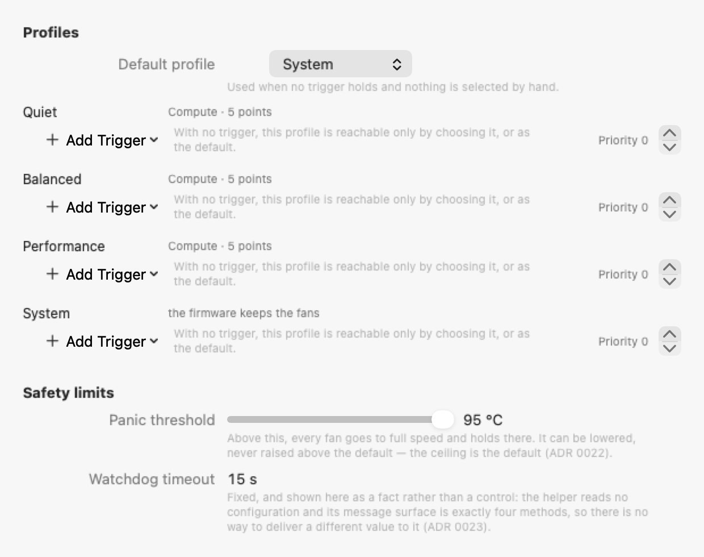
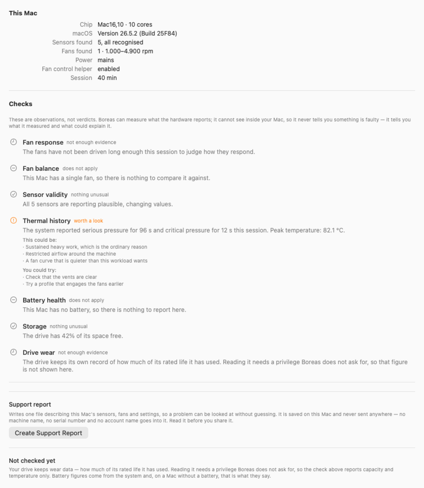
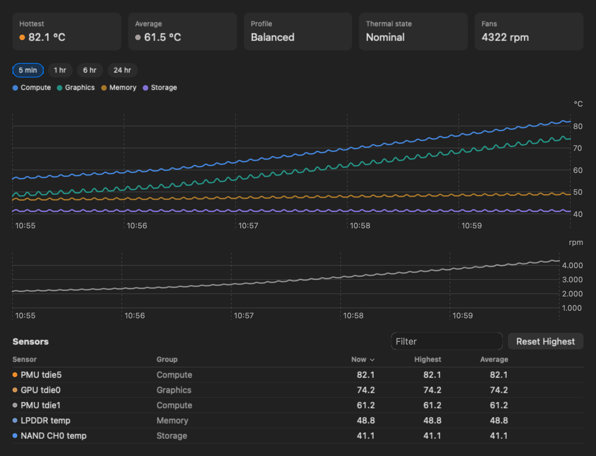
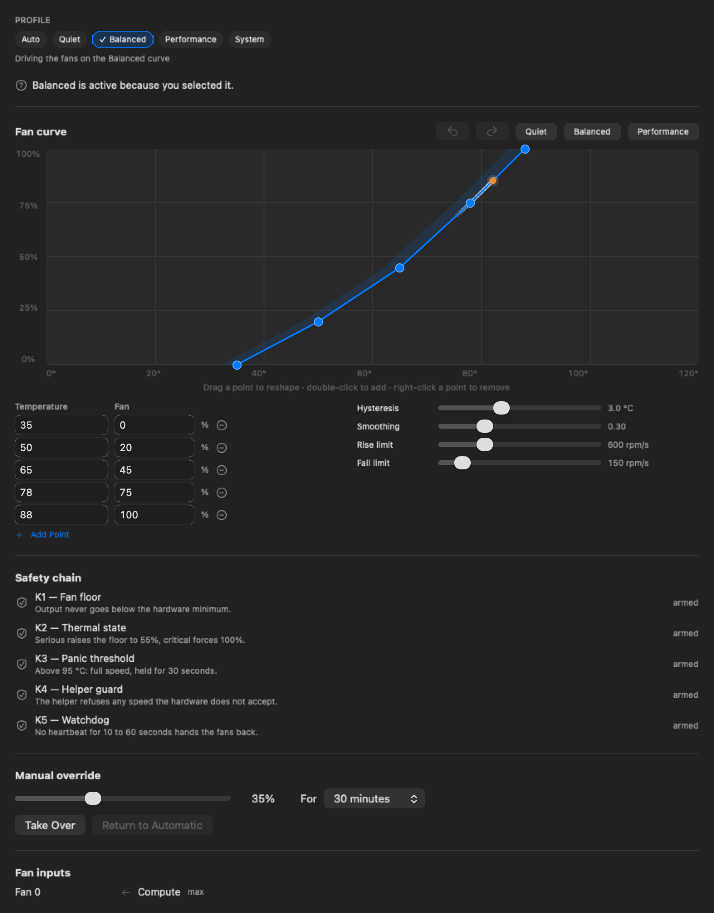

<div align="center">


# Boreas

**面向 Apple Silicon Mac 的风扇控制与温度监测**

免费开源。不需要内核扩展，不改动 SIP，没有遥测。

[](https://github.com/mahirozdin/BoreasMacFanControl/actions/workflows/ci.yml)
[](LICENSE)
[](#系统要求)
[](#系统要求)
[](https://swift.org)

[Türkçe](README.tr.md) · [English](README.md) · [Русский](README.ru.md) · [Español](README.es.md) · **简体中文**

</div>

---

<div align="center">



<sub>控制引擎的一次真实运行 —— 温度上升，曲线映射，风扇跟随。</sub>

</div>

---

> **这是译文，可能落后于英文版。** 具有约束力的始终是
> [`README.md`](README.md)；若有出入，以英文为准。

> **测试版 —— 0.1.1。** 已签名、已公证，可以安装。它只在**一台 Mac** 上运行过：
> Mac mini（M4，2024）；其他所有 Apple Silicon 机型都应该可用，但一台也没试过。
> 请把它当作测试中的软件：最初一段时间留意温度，若有异常就退出 Boreas——退出会
> 立即把风扇交还固件。仅做监测不需要任何权限、也不改动任何东西，这是最稳妥的
> 起步方式。

## 它能做什么

<div align="center">

<br>


</div>

Boreas 是一个菜单栏应用，它让你看见 Mac 内部正在发生什么，并由你决定它该如何
散热。

- **读取 Mac 暴露的每一个温度传感器**——性能核心与能效核心、GPU、内存、存储、
  供电、机身
- **查看风扇转速**，并显示其真实的最小值与最大值
- **自己塑造风扇曲线**：用一条连续曲线，而不是一串开关规则，因此转速变化是平滑
  的，而不是阶梯式的
- **按条件自动切换配置文件**：电源来源、正在运行的应用、时间段或热压力
- **记录测量数据**为 JSONL 或 CSV，并设有绝不会突破的磁盘上限
- **在情况变化时收到提醒**——阈值、热压力、不再跟随目标的风扇——噪声控制不会挡住
  紧急情况
- **接入你自己的工具**：用 webhook 或脚本，而不是一个没人愿意维护的邮件客户端
- **以五种语言阅读**：英语、土耳其语、俄语、西班牙语和简体中文
- **保持安静，或保持凉爽**——这个取舍属于你，而不是固件

## 安装

**测试版。** 已签名并公证，因此安装时不会遇到 Gatekeeper 的阻拦。

```bash
brew tap mahirozdin/boreas
brew trust mahirozdin/boreas   # Homebrew 在运行第三方 tap 之前会要求确认
brew install --cask boreas
```

或者从[最新发布](https://github.com/mahirozdin/BoreasMacFanControl/releases/latest)
下载已签名的 `.dmg`，并用旁边发布的 `.sha256` 校验：

```bash
shasum -a 256 -c Boreas-0.1.1.dmg.sha256
```

从源码构建同样可行；如果你想改动什么，那是唯一的途径：

```bash
git clone https://github.com/mahirozdin/BoreasMacFanControl.git
cd BoreasMacFanControl
brew bundle          # xcodegen、swiftlint、xcbeautify
make generate        # 从 project.yml 生成 Xcode 项目
```

然后打开 `Boreas.xcodeproj` 运行。**监测无需签名即可工作。** 风扇控制需要特权
助理，而 macOS 只会注册用 Developer ID 签名的助理——因此你需要在
`Local.xcconfig` 中填入自己的签名身份（复制 `Local.xcconfig.example` 并填上你的
团队标识符）。没有它，Boreas 仍是一个什么都不索取的完整监测工具。

## 快速开始

1. **打开 Boreas。** 它出现在菜单栏并立即开始读取传感器——不需要权限、不需要
   设置、没有要配置的东西。
2. **在面板中选择一个配置文件**：安静、均衡、性能，或者选择“系统”把一切交回固件。
3. **启用风扇控制**——当你真的想让曲线驱动风扇时。这是唯一一个会索取管理员密码
   的步骤，只有一次。

第 1 步和第 2 步本身就有用。第 3 步是可选的，而且可以撤销。

<details>
<summary><b>更多界面</b></summary>

<div align="center">










</div>
</details>

## 为什么

在 Apple Silicon 上，散热完全由固件控制，且不提供任何设置。这在两个方向上都是
问题。

**有时太安静了。** 在长时间编译、导出视频或运行虚拟机时，固件升速既晚又保守。
芯片降频，本可以更快完成的工作没有完成。

**有时又太吵了。** 录音、夜里工作、开会——这些时候，多热几度换来安静是很划算的
交易。

两者出自同一处：这个决定对你是关闭的。Boreas 把它打开。

## 系统要求

| | |
|---|---|
| **Mac** | Apple Silicon——M1 或更新。Intel 按设计不在范围内 |
| **macOS** | 14.0 Sonoma 或更新 |
| **磁盘** | 几兆字节 |

### 已验证的硬件

Boreas 只在一台机器上开发，因此坦白覆盖范围比一张长长的兼容性表更重要。

| 硬件 | 状态 |
|---|---|
| Mac mini（M4，2024）— `Mac16,10` | **已在真实硬件上验证**：40 个有名称的传感器，1 个风扇在编辑过的曲线上实测从 1000 升到 4021 rpm，并在每条失败路径上交还固件 |
| 其他所有 Apple Silicon Mac | **应该可用；未经验证。** 还没有人在上面跑过 |


**关于笔记本的说明。** 这里的全部测量都来自一台台式 Mac。MacBook 的散热余量更小、
降频更早，因此在 Mac mini 上舒适的曲线放到笔记本上可能太安静了；使用电池时固件还会
更保守。设计中没有任何东西是台式机专属的——只是还没有在笔记本上验证过，而一份来自
MacBook 的传感器报告同样有价值。

**“未经验证”在实践中意味着什么。** 传感器命名在不同芯片世代之间不同，而多风扇
机型会触发从未遇到过第二个风扇的平衡代码。这里没有一句是空谈：映射是对硬件键的
启发式判断，你的机器可能给出 Boreas 不认识的传感器。

如果你的 Mac 把传感器显示为 `uncategorized`，那是有用的信息——
**设置 → 传感器 → 报告这些传感器**会在浏览器中打开一份预先填好的
[未知传感器报告](https://github.com/mahirozdin/BoreasMacFanControl/issues/new?template=unknown_sensor.yml)，
其中包含你 Mac 的机型标识符、芯片、未识别的传感器名称和风扇数量，仅此而已。
未映射的传感器之所以显示而不隐藏，正是为了让它们能被报告。

## 权限

在安装任何会碰你风扇的东西之前，这一节值得读。

**Boreas 会索取什么**

| 权限 | 何时 | 频率 |
|---|---|---|
| 管理员密码 | 仅在启用风扇控制时 | **一次** |
| 后台权限 | 注册风扇助理时 | 一次，在系统设置中 |
| 通知 | 仅在你打开提醒时 | 一次 |

**Boreas 绝不索取什么**

- ❌ 关闭 System Integrity Protection
- ❌ 内核扩展或 DriverKit 驱动
- ❌ 进入恢复模式或更改安全策略
- ❌ 完全磁盘访问权限
- ❌ 辅助功能或屏幕录制
- ❌ 摄像头、麦克风、位置、通讯录或日历

**读取温度完全不需要任何特权。** 如果你从不启用风扇控制，Boreas 就是一个什么都
不索取的完整监测工具。

移除应用会让一切恢复原样。固件和 NVRAM 都不会被改动，Boreas 一停止，风扇设置就
立刻回到 macOS 的默认值。

## 工作原理

```
你的会话（无特权）                    Root                     硬件
┌──────────────────────┐   XPC     ┌────────────────┐  IOKit ┌──────────────┐
│ Boreas.app           │◀────────▶ │ 风扇助理       │◀─────▶ │ SMC          │
│  控制引擎            │   双向    │  安全过滤器    │        │ HID 传感器   │
│  传感器读取     ─────┼───────────┼────────────────┼──────▶ │ 电源         │
│  配置                │  验证签名 │  watchdog      │        └──────────────┘
└──────────────────────┘           └────────────────┘
```

读取温度不需要特权，所以直接访问硬件。只有写入风扇转速才需要助理，而助理的全部
接口只有四个方法：描述风扇、下发目标、交还控制权，以及一次心跳。

它不读取任何配置，不打开任何网络连接，也不启动任何进程。

## 曲线编辑器

<div align="center">

</div>

曲线是连续的，不是一级级的阈值。拖动一个点、双击添加、右键删除。形状不可能变得
无效——编辑会被夹紧而不是被拒绝，因此任何拖动序列都不会产生一条越热反而越低的
曲线。每一次编辑都会在一个周期内到达风扇。

## 安全

风扇控制软件在这件事上出错会损伤硬件，因此在五个位置，设计把安全放在用户偏好
之前。

| 层 | 规则 | 能关闭吗？ |
|---|---|---|
| 风扇下限 | 绝不低于硬件最小值 | 不能 |
| 热状态 | macOS 报告 `serious` → 提升；`critical` → 全速 | 不能 |
| 紧急阈值 | 任一传感器越过上限 → 全速并保持 | 不能，只能调低 |
| 助理守卫 | 超出范围的命令会被拒绝，而不是夹紧 | 不能 |
| **Watchdog** | 没有心跳 → 风扇交还固件 | 不能 |

最重要的是 watchdog。如果 Boreas 崩溃、卡死、被强制退出，或者你退出登录，助理会
察觉到沉默并自行把控制权交还固件。它不依赖应用自己善后，因为真正要紧的场景恰恰
是应用做不到的那些。

每一层都只能提高转速，没有一层能降低。

**Boreas 做不到的事：** 它无法为一台固件已经停转风扇的 Mac 降温，也无法超过硬件
所报告的最高转速。凡是固件拒绝的命令，助理同样拒绝，而不会反复重试。

## 隐私

- **没有遥测。** 没有分析 SDK，没有崩溃上报 SDK，没有广告标识符
- **默认不联网。** 开箱状态下 Boreas 不建立任何连接。唯一能打开连接的代码只存在
  于一个目录中，而且只有在你自己配置了 webhook 时才会运行
- **你的数据仍然属于你**——存放在你能读懂的文件里，在你自己的机器上

这些不是关于意图的承诺。每一次提交都会由一道
[会让构建失败的检查](scripts/gates/check-privacy.sh)验证：一旦出现分析类符号或
意料之外的网络调用，构建就会红。

## 配置

一切都在一个你可以阅读、编辑并纳入版本控制的文件里：

```
~/Library/Application Support/Boreas/config.json
```

```json
{
  "schemaVersion": 1,
  "general": { "samplingIntervalSeconds": 2 },
  "safety": { "panicTemperatureCelsius": 95, "watchdogTimeoutSeconds": 15 },
  "profiles": [
    {
      "name": "Quiet",
      "priority": 0,
      "binding": {
        "input": { "group": "compute", "aggregate": "max" },
        "curve": [
          { "celsius": 40, "duty": 0    },
          { "celsius": 58, "duty": 0.15 },
          { "celsius": 72, "duty": 0.4  },
          { "celsius": 82, "duty": 0.7  },
          { "celsius": 88, "duty": 1    }
        ]
      },
      "hysteresis": 5,
      "smoothing": 0.2,
      "slew": { "maxRisePerSecond": 300, "maxFallPerSecond": 100 }
    }
  ]
}
```

这段片段是从真实的 `boreas export` 输出复制来的，不是手写的——一个加载不了的
示例比没有示例更糟。

损坏的文件只能回退：Boreas 会以最后一个有效状态继续运行，把风扇留给固件，而不是
依据一份它读不懂的文档去动作。`config.backup.json` 在每次写入**之前**刷新。超出
范围的值会被夹紧，而不是被拒绝。

完整 schema：[`schema/config.schema.json`](schema/config.schema.json) ·
参考：[`docs/architecture/configuration.md`](docs/architecture/configuration.md)

## 命令行

在没有窗口服务器的机器上，`boreas` 能做菜单栏能做的一切：

```
boreas status            一眼看到温度、风扇与电源
boreas sensors [--raw]   所有传感器，按组显示；--raw 显示硬件名称
boreas profile [名称]    列出配置文件，或立即启用一个
boreas profile --auto    把决定权交回配置文件触发器
boreas install           安装风扇控制助理
boreas uninstall [--all] 移除助理；--all 同时删除已保存的设置
boreas export [文件]     写出配置；不给文件名则输出到 stdout
boreas import <文件>     校验之后替换配置
```

```console
$ boreas status
power    : adapter
sensors  : 40  hottest PMU Die 1 75.1 C
fan 0    : Fan 1 1000 rpm (1000-4900, 0%)
control  : 已启用
```

从命令行选择的配置文件**只在当前生效，绝不会写入磁盘**——一个被保存下来的选择会
永久压过所有配置文件触发器。

## 疑难解答

看起来像故障的一部分，其实是安全保障在履行职责，所以简短版值得放在手边：

| 你看到的 | 最可能的原因 |
|---|---|
| 风扇转速从不变化 | 风扇控制未启用——读取不需要特权，写入需要助理。没有它，Boreas 就是一个监测器，并且**按设计不显示任何错误** |
| 助理停在“等待批准” | 第二步归 macOS 管：系统设置 → 通用 → 登录项与扩展 |
| 配置文件从不自动切换 | 手动选择的优先级高于任何触发器，除非你设定了时限，否则不会过期。`boreas profile --auto` 会把决定权交回 |
| 转速自己恢复原状 | 是 watchdog。退出、崩溃、睡眠或注销时，风扇都会无条件回到固件——这是功能，不是缺陷 |
| 风扇卡在全速 | 紧急阈值或 macOS 的热状态。两者都会自行解除；两者都无法关闭 |
| 传感器显示为未分类 | 传感器键是不透明的代码，未映射的会显示而不是隐藏，以便被报告 |
| 收不到通知 | 在你打开提醒之前不会请求任何权限，而一次拒绝会把开关重新关掉 |
| 某项设置没有保留 | 从 CLI 选择的配置文件是有意只在当前生效的。损坏的配置文件会回退到最后一个有效状态 |

完整细节，以及开 issue 前该收集什么：
[`docs/operations/troubleshooting.md`](docs/operations/troubleshooting.md)。

## 卸载

```bash
boreas uninstall --all
```

这会移除特权助理并删除
`~/Library/Application Support/Boreas`。然后把应用拖到废纸篓。

不加 `--all` 时助理被移除，你的设置会保留。无论哪种方式：

- **风扇立刻回到固件**——助理在停止时就交还了控制权，何况 watchdog 本来也会这么做
- 不会改动任何固件设置、NVRAM 变量或系统文件，因为它们从来就没有被写过
- `LaunchDaemons` 中不留任何东西，`launchctl` 也不再认识这个服务

这不是想当然，而是从五个角度验证过的——`SMAppService` 状态、`launchctl`、系统
文件夹、被删除的支持目录，以及不存在的进程。**它不会被自动复查：** `install` 和
`uninstall` 会改变助理的注册状态并索取密码，因此命令行测试套件有意执行除这两者
之外的一切。

## 路线图

| 阶段 | 状态 |
|---|---|
| 文档体系与检查 | ✅ 完成 |
| 工具链与项目骨架 | ✅ 完成 |
| 传感器与风扇读取 | ✅ 完成 |
| 特权助理与 XPC | ✅ 完成 |
| 风扇控制与安全链 | ✅ 完成 |
| 控制引擎——曲线、迟滞、配置文件 | ✅ 完成 |
| 用户界面与曲线编辑器 | ✅ 完成（还差一次 VoiceOver 走查） |
| 通知、日志、诊断、CLI、自动化 | ✅ 完成 |
| 签名、公证、发布 | ✅ 完成 —— 0.1.1 已签名、已公证，并作为测试版发布 |

之后，并且有意不放在 1.0 之前：WidgetKit 小组件、App Intents、本地指标端点、
配置共享，以及应用内更新。

当前状态与下一项任务：[`TODO.md`](TODO.md)。

## 人们真正会问的问题

**我的 Mac 为什么这么热？**
通常是持续负载——编译、导出视频、运行虚拟机。在 MacBook 上，房间偏热或出风口被挡住
会让同样的负载更早触发降频。Boreas 会显示芯片的哪个部分在发热，让你能分辨是 CPU 在
忙，还是散热出了问题。

**Apple Silicon Mac 上能控制风扇转速吗？**
可以，通过 System Management Controller，借助一个小的特权助理。Boreas 只索取一次
管理员密码，之后再也不需要。

**需要关闭 SIP 或安装内核扩展吗？**
不需要，两者都不需要。这正是这个项目成为现在这个样子的主要原因。

**降低风扇转速安全吗？**
降低会提高热风险，所以五个安全层只能提高转速，其中三个无法关闭。

**如果应用崩溃了会怎样？**
助理不再收到心跳，会在几秒内把风扇交还固件。这是经过测试的，不是假设的。

**它能在我的 Intel Mac 上用吗？**
不能。Intel Mac 使用不同的传感器与 SMC 布局，同时支持两者会让一个人维护的代码库
翻倍。

**Mac 变热时它能给我发邮件吗？**
不能直接发，而且这是有意的。一个 webhook 或一行脚本就能做到，而且两者都不会让这个
项目为保管你的邮箱密码负责——
[`docs/operations/notifications.md`](docs/operations/notifications.md) 里有现成的
示例。

## 参与贡献

欢迎错误报告、硬件报告和翻译修正。请先阅读
[`CONTRIBUTING.md`](CONTRIBUTING.md)——它讲了环境搭建、工作流程，以及这个项目对
自己施加的规则。

眼下最有用的贡献是**一份来自非 M4 mini 机型的传感器报告**。五种界面语言中有三种
也还没有母语者读过；[`TRANSLATORS.md`](TRANSLATORS.md) 明确写出了是哪几种。

### 开发

```bash
make next            # 告诉你下一项任务是什么
make check           # 运行所有检查——push 之前必须全绿
make test            # Swift 包测试
make smoke           # 在真实 Mac 上的硬件冒烟测试
```

本仓库采用文档驱动、由机器强制规则的工作流程。请从 [`BOOT.md`](BOOT.md) 开始，
然后是 [`AGENTS.md`](AGENTS.md)，再是 [`TODO.md`](TODO.md)。环境搭建与应用自带的
诊断命令：[`docs/development/setup.md`](docs/development/setup.md)。

## 免责声明

Boreas 按现状提供，不附带任何形式的担保。**降低风扇转速会提高热风险，其责任由你
承担。** 对硬件保修的任何影响同样由你承担。本项目与 Apple Inc. 无关联，未获其
授权，也未获其认可。

## 许可证

[Apache-2.0](LICENSE)。归属与商标声明：[`NOTICE`](NOTICE)。

<div align="center">
<sub>Boreas —— 北风。</sub>
</div>
